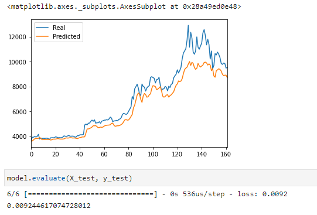

# LSTM Stock Predictor (Gear and Greed Index v. Closing Prices)

### The LSTM model was used used to train historical data to predict stock prices.  The results of each model are detailed below.

The following model adjustments were utilized in both instances:

    - Batch Size = 2
    - Window Size = 2
    - Epochs = 75
    - Number of Units = 30

## LSTM Stock Predictor using Fear & Greed Index:

## LSTM Stock Predictor using Closing Prices:

## Summary of Findings:

The model with the lower loss is the model based on actual closing pricies.  The model based on closing prices tracks closer to the actual closing prices over time.  The best window size I found was 2 with a batch size of 2 in both inestances.  Epoch of 75 also led to the best results.  I am concerned that the model may be overfit to an extent but these adjustments did result in a low loss.  